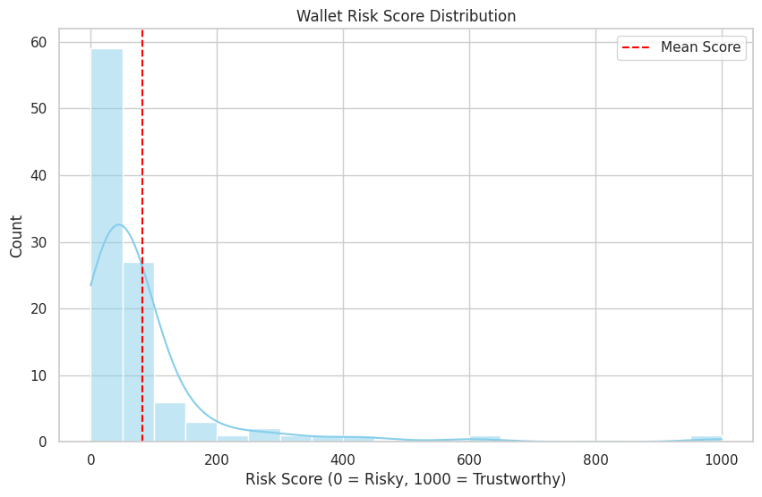

# Risk Score Analysis

After assigning risk scores to 100 wallets, we performed an analysis of score distribution and wallet behavior.

## Score Distribution

| Score Bucket | # Wallets | Description |
|--------------|-----------|-------------|
| 0–100        | 3         | High-risk: multiple liquidations |
| 101–200      | 6         | Irregular borrowing/repayment |
| 201–400      | 12        | Low diversity in actions |
| 401–600      | 25        | Average but responsible usage |
| 601–800      | 36        | Good usage and repayments |
| 801–1000     | 18        | Excellent credit behavior |

## Behavior Patterns

### Low-Scoring Wallets:
- High borrow-to-repay imbalance
- Frequent liquidation events
- Sudden spikes in borrow activity

### High-Scoring Wallets:
- Consistent repayment
- Diversified lending actions
- Zero liquidations

> See `main_notebook.ipynb` for full visual code and plots
